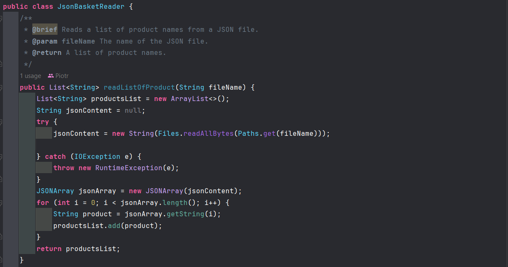
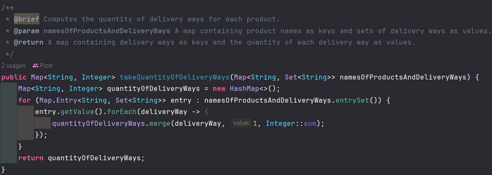
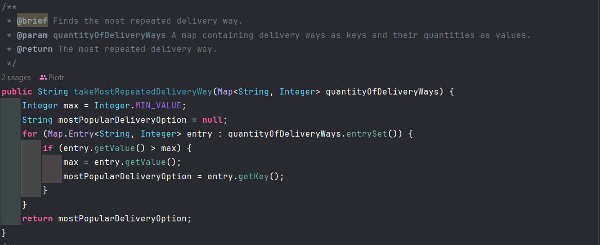
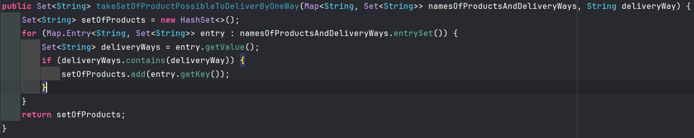
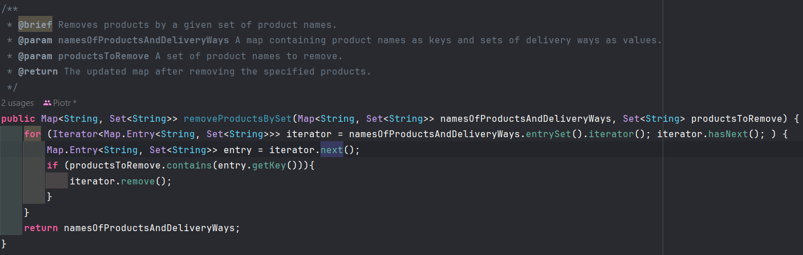
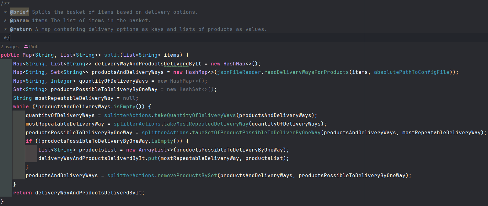

# Zadanie rekrutacyjne Ocado 2024
## Opis zadania 🖥️:
Naszym zadaniem jest znalezienie optymalnego sposobu dostawy produktów z naszego sklepu internetowego. Wszystkie dane są dostępne w pliku config.json i są w postaci nazwa przedmiotu a następnie lista sposobów dostawy. Musimy odpowiednio zaprogramować naszą klasę BasketSplitter a w niej metody split, która rozdzieli nam nasze produkty na odpowiednie i najbardziej optymalne sposoby dostawy.
## Wymagania do programu 🫣:
◠Algorytm dzieli produkty na możliwie minimalną liczbę grup dostaw.  
● Największa grupa zawiera możliwie najwięcej produktów.
## Użyte technologie 🧑‍🔧:
  

## Opis rozwiązania 🤔:
### Rozwiązując zadanie zdecydowałem się utworzyć 2 klasy pomocnicze. 
### Pierwsza z nich - JsonBasketReader implementuje 2 metody:
### - readListOfProducts odpowiedzialną za odczytywanie listy z pliku formatu json. (Nie byłem pewny czy lista ta ma być przekazywana jako lista czy jako plik json więc zaimplementowałem tą metodę)
### Wygląd funkcji:

### - readDeliveryWaysForProducts odpowiedzialną za odczytywanie i zwracanie mapy. Mapa ta jako klucz ma nazwę produktu z naszej listy zakupów klienta a jako wartość set sposobów dostaw (Dalej opowiem dlaczego zdecydowałem się na skorzystanie z setu zamiast listy)
### Wygląd funkcji 🤗:

### Druga Klasa to SplitterActions która implementuje 4 metody:
  ### - takeQuantityOfDeliveryWays odpowiedzialną za zwrócenie mapy której kluczem jest nazwa dostawy a wartością ilość jej występowania. W naszym algorytmie chcemy wysłać jednym sposobem jak najwięcej rzeczy co będzie możliwe dzięki tej funkcji.
### Wygląd funkcji 🤗:

  ### - takeMostRepeatedDeliveryWay odpowiedzialną za zwrócenie naszego najczęściej powtarzalnego sposobu dostawy z naszej mapy z ilością dostaw. Będziemy jej potrzebować w dalszym etapie naszego zadania.
### Wygląd funkcji 🤗:

  ### - takeSetOfProductPossibleToDeliverByOneWay odpowiedzialną za zwrócenie setu przedmiotów które będą wysłane jednym sposobem dostawy. Używamy jej w naszym przypadku zawsze ze sposobem dostawy najczęściej powtarzalnym.
### Wygląd funkcji 🤗:

  ### - removeProductsBySet odpowiedzialną za usunięcie z naszej mapy zawierającej listę zakupów klienta rzeczy które zostały już wysłane (zwracane w funkcji powyżej).
### Wygląd funkcji 🤗:
  
Jak widzimy w tych klasach bardzo często używamy operacji contains(). Właśnie dlatego zdecydowałem się korzystać z kolekcji setu a nie listy gdyż możemy dzięki temu zredukować złożoność obliczeniową z O(n) na O(1). (Przy dużym koszyku zakupów naprawdę to ułatwia szybkość przeszukiwania)  
Dzięki tym 2 klasom jesteśmy w stanie zaimplementować odpowiednio naszą klasę BasketSplitter. Jako pola tej klasy ustawiamy obydwie klasy które stworzyliśmy oraz dodajemy naszą ścieżkę do pliku config.json.
W konstruktorze tworzymy obiekty tych klas oraz przypisujemy wartość naszej ścieżki do pliku konfigurajcego.  
### Teraz przechodzimy do naszej metody split. Działa ona w następujący sposób:
- Tworzymy pętlę której warunkiem jest że nasza mapa z listą zakupów i sposobami dostaw ma być pusta.
- wykonujemy po koleji kroki: Sprawdzamy ilość powtarzania się dostaw, zapisujemy dostawę najczęściej powtarzającą się, znajdujemy rzeczy które są możliwe do wysłania tym sposobem, dodajemy do naszej mapy wynikowej ten sposób dostawy i set(konwertujemy go na listę) oraz usuwamy te rzeczy z naszej mapy zakupów i sposobów dostaw.
- kończymy wtedy gdy mapa zakupów i sposobów dostawy jest pusta - tzn. znaleźliśmy dostawę dla wszystkich naszych przedmiotów.
- jako wynik zwracamy naszą mapę ze sposobem dostawy jako kluczem i jako wartością listą przedmiotów które będą nim wysłane.
### Wygląd funkcji 🤗:

UWAGA!!! Jeżeli znajdzie się 2 sposoby dostaw z taką samą ilością przedmiotów możliwych do wysłania nie mamy wpływu na to którym sposobem będą one wysłane. Ponieważ używamy mapy nie mamy wpływu na kolejność naszych elementów w entrySet(). W przyszłości można byłoby dodać np cenę danej dostawy, porównywać ją w naszym programie i na tej zasadzie wybierać nasz sposób dostawy.  
### Testy 📝:
Wszystkie metody zostały przetestowane przez testy jednostkowe.
## Wasze wymagania 💭:
● W odpowiedzi na maila z zadaniem spodziewamy się archiwum .zip lub .tar.gz z:  
○ kodem źródłowym aplikacji  
○ plikiem .jar ze zbudowaną biblioteką  
◠Można korzystać z dowolnych bibliotek, należy jednak wiedzieć, co robią.  
○ Uwaga! Prosimy aby jar zawierał wszystkie wymagane zależności aplikacji (tzw. fat-jar).  
◠Aplikacja powinna być napisana w Javie 17 lub 21  
● To, na co zwracamy uwagę:  
○ poprawność wyników   
○ czytelność kodu  
○ jakość projektu - chcielibyśmy, aby kod, a przynajmniej jego kluczowe fragmenty, były pokryte testami  
◠Możesz uzyskać dodatkowe punkty za użycie narzędzia do budowania projektu oraz stworzenie pliku README wraz z kluczowymi informacjami  
## Podsumowanie 😎:
Mam nadzieję że spełniłem wymagania dotyczące tego zadania. Rozwiązanie zostało wysłane do was na maila jak i zarówno dodane tutaj na mój profil na githubie. W dodatku uważam że samo w sobie było ciekawe do napisania i na pewno ciekawsze niż pojedyncze problemy na letCode.  

  
